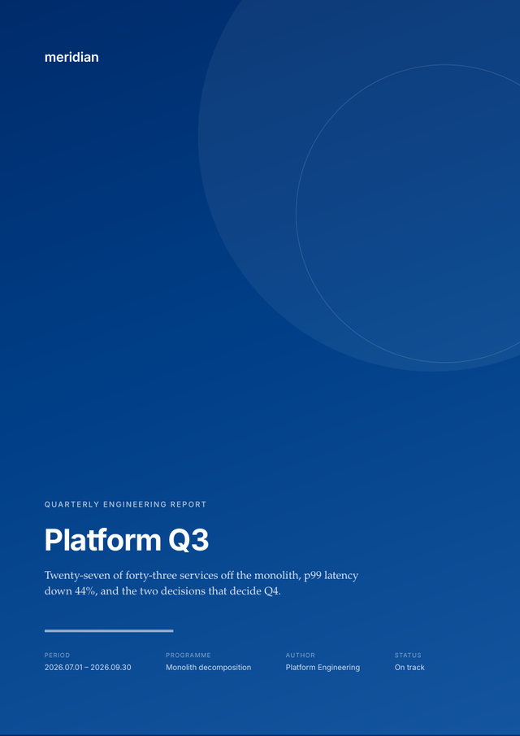
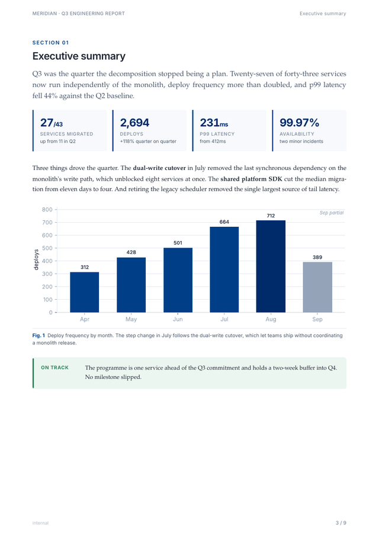
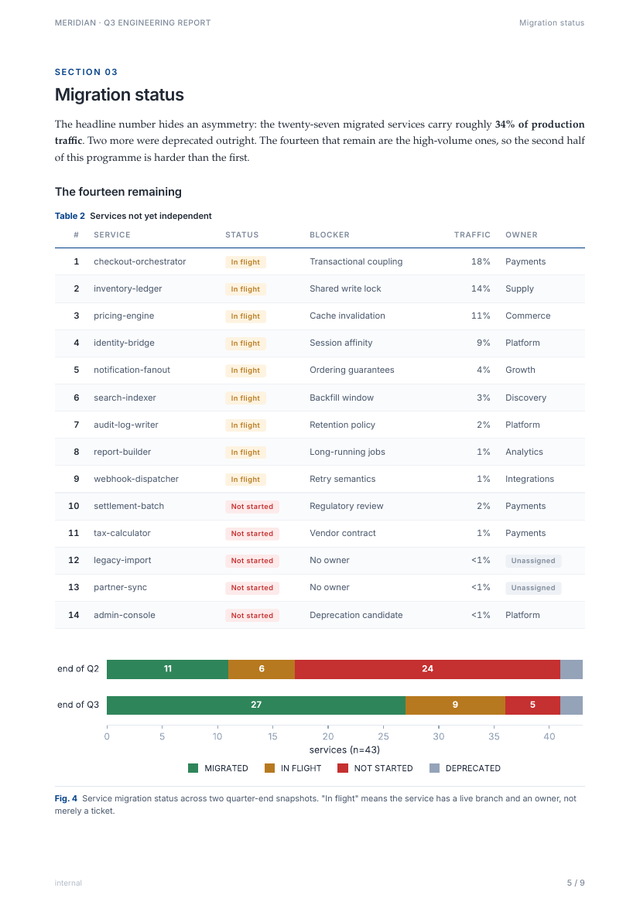
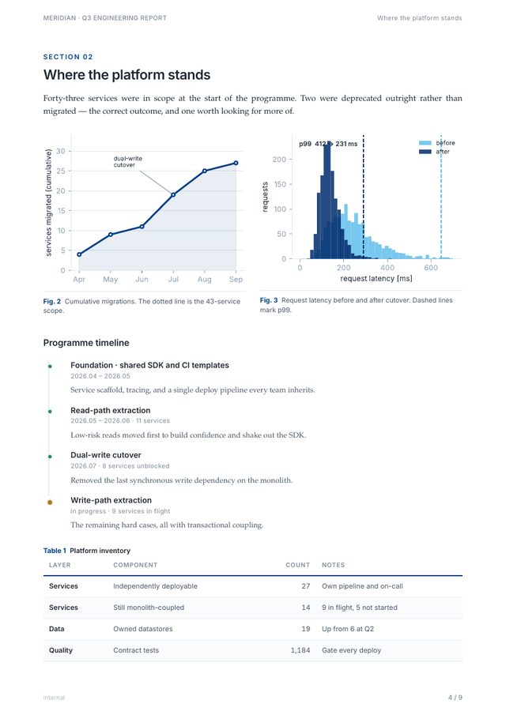
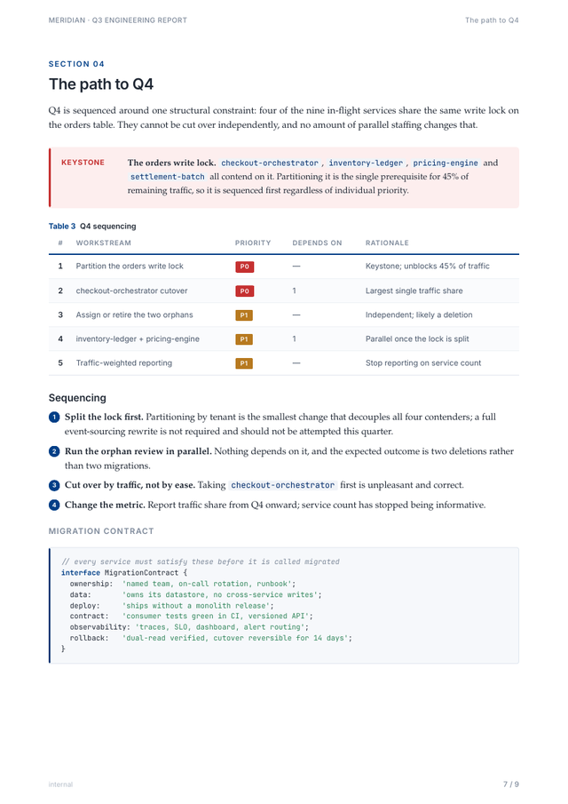
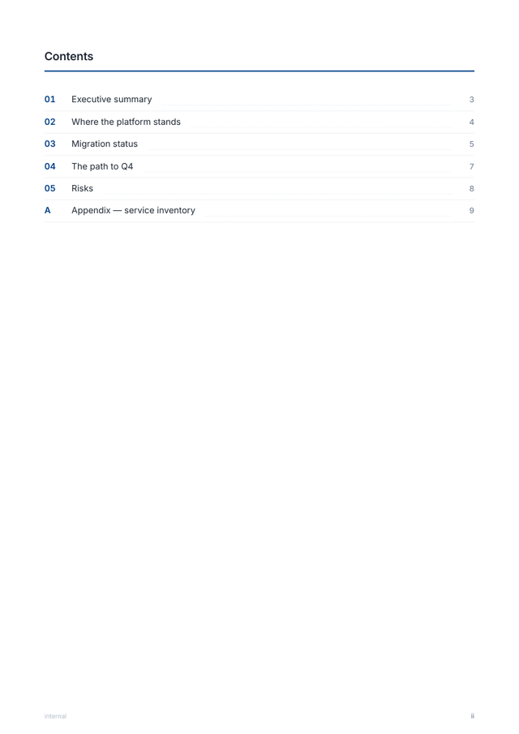

<div align="center">

# folio

**Print-ready documents from HTML. One design system. No AI slop.**

Your agent can already write the words. It cannot make them look like this.

[](https://pypi.org/project/folio-press/)
[](https://pypi.org/project/folio-press/)
[](LICENSE)
[](https://github.com/abhirajsingh101/folio/actions/workflows/ci.yml)









*Real output. No template shopping, no CSS written by hand.*

</div>

---

## Why this exists

Ask any coding agent for a PDF report and you get one of two things: a Markdown
file printed through a default stylesheet — flat, undifferentiated, obviously
machine-made — or twenty minutes of it inventing CSS that will be different
next time.

The problem isn't the writing. It's that **Markdown has about eight visual
elements**, and a document that looks designed needs thirty: a cover
composition, running headers, numbered figures, metric tiles, callouts with
tone, status pills, pull quotes, a table of contents whose page numbers are
real.

folio gives your agent that vocabulary, backed by a design system it cannot
drift from, and renders it with the one engine that actually implements CSS
paged media.

## Install

```bash
pipx install "folio-press[all]"     # or: uv tool install "folio-press[all]"
folio doctor                        # tells you exactly what your machine is missing
```

`folio doctor` is not decoration. WeasyPrint binds Pango, cairo and
GDK-PixBuf through ctypes, and **pip cannot install those** — it is the single
most common reason a document toolchain dies on someone else's laptop. folio
detects that state, prints the exact command for your platform, and falls back
to a browser so you still get a document while you fix it.

If you cannot install native libraries at all, the fallback needs no root:

```bash
pip install playwright && playwright install chromium
```

You lose running headers, page numbers and contents-page references — folio
says so on every build — but you get a document.

<details>
<summary>Native libraries, per platform</summary>

```bash
# Debian / Ubuntu
sudo apt-get install -y libpango-1.0-0 libpangoft2-1.0-0 libharfbuzz0b \
                        libcairo2 libgdk-pixbuf-2.0-0
# Fedora
sudo dnf install -y pango cairo gdk-pixbuf2
# Arch
sudo pacman -S --needed pango cairo gdk-pixbuf2
# macOS
brew install pango cairo gdk-pixbuf libffi
# Windows — install MSYS2, then in its shell:
pacman -S mingw-w64-x86_64-pango
```

</details>

## Use it

```bash
folio init                    # scaffold document.html + charts.py
folio build document.html     # → document.pdf + document.page.html
```

One source gives you both the PDF for the record and a self-contained HTML
page you can share as a link — the thing LaTeX and Typst structurally cannot do.

Write documents in plain HTML using the component vocabulary:

```html
<div class="metrics">
  <div class="metric"><span class="v">4,157</span><span class="l">Commits</span>
       <span class="d">since 2026.02.13</span></div>
</div>

<figure>
  
  <figcaption><span class="fnum">Fig. 1</span>Say what to conclude, not what the axes are.</figcaption>
</figure>

<div class="callout risk">
  <span class="ico">Keystone</span>
  <div class="body"><p>Until this lands, nothing downstream ships.</p></div>
</div>
```

`folio components` prints the full catalogue — cover, contents, sections,
metric tiles, figures, tables, status pills, callouts, timeline, numbered
steps, pull quotes, code blocks.

## Charts that belong to the page

```python
from folio import theme

plt = theme.use()                       # palette, fonts, grid, tabular figures
fig, ax = plt.subplots(figsize=(6.6, 2.5))
ax.bar(labels, values, color=theme.BRAND, zorder=3)
theme.grid(ax)
theme.save(fig, "charts/velocity.svg")
```

Vector output with text as outlines, so a figure renders identically no matter
which fonts the machine has. `folio build` runs a sibling `charts.py`
automatically, so figures are never stale.

## Branding

One hook covers most projects. Drop a `brand.css` next to your document; it is
appended after the design system, so it always wins:

```css
:root { --brand: #7A1F3D; --brand-deep: #4E1226; }
```

Everything — cover gradient, section kickers, chart palette, table rules,
callout accents — re-derives from that.

## For agents

folio ships a [Claude Code skill](skill/SKILL.md) and works with any agent that
can run a command:

```bash
mkdir -p ~/.claude/skills && cp -r skill ~/.claude/skills/folio
```

For Codex, Cursor, or anything reading `AGENTS.md`, see
[docs/AGENTS-snippet.md](docs/AGENTS-snippet.md).

The skill is deliberately thin. The design system, the chart theme and the
print furniture are *files*, not prose — so every document comes out
consistent instead of being re-improvised each time.

## Why WeasyPrint

Because it was measured. The same 11-page report was built three times — in
WeasyPrint, Typst, and LaTeX — with identical content, figures and typefaces:

| | WeasyPrint | Typst | LaTeX |
|---|---|---|---|
| Compile | 2.04 s | **0.84 s** | 9.55 s |
| Source lines | 889 | 560 | **540** |
| Failed compiles before first PDF | **0** | 4 | 7 |
| Bugs hit | **6** | 7 | 12 + blocker |
| Web output from same source | **yes** | no | no |

LaTeX set the most even page — microtype is real — but needed seven failed
compiles and a full engine switch to get there. Typst is excellent and the
efficiency winner. WeasyPrint won on layout control for screenshot-heavy
documents, on the edit loop, and on shipping a web version from one source.

Full write-up, including every bug: [docs/ENGINE-CHOICE.md](docs/ENGINE-CHOICE.md).

## Not for

Slide decks. Academic submissions where a venue mandates its own LaTeX class.
Anything under ~2 pages, where the design system is overhead.

## Contributing

New components belong in the design system, never inline in a document — that
is the whole point. See [CONTRIBUTING.md](CONTRIBUTING.md).

MIT licensed.
