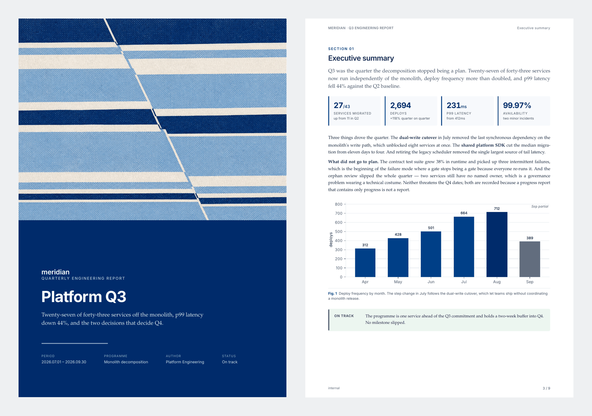
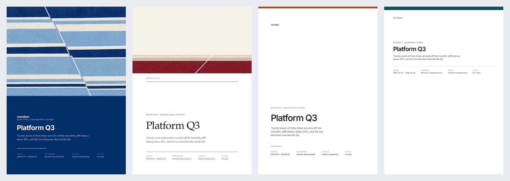
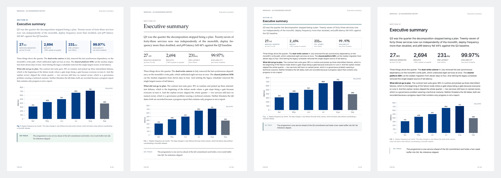

<div align="center">

# folio

**Print-ready documents from HTML. One design system. No AI slop.**

Your agent can already write the words. It cannot make them look like this.

[](https://pypi.org/project/folio-press/)
[](https://pypi.org/project/folio-press/)
[](LICENSE)
[](https://github.com/abhirajsingh101/folio/actions/workflows/ci.yml)



*Cover and interior from one HTML file. The cover plate is generated —
`folio imagery` says when that is worth doing, and when it is not.*





*One document, four design directions. Same content, same markup —
different typographic systems, and charts that re-palette to match.
Two of the four take a cover image; the other two are built not to.*

</div>

---

## Why this exists

Ask any coding agent for a PDF report and you get one of two things: a Markdown
file printed through a default stylesheet — flat, undifferentiated, obviously
machine-made — or twenty minutes of it inventing CSS that will be different
next time.

The problem isn't the writing. It's that **Markdown has about eight visual
elements**, and a document that looks designed needs thirty: a cover
composition, running headers, numbered figures, metric tiles, callouts with
tone, status pills, pull quotes, a table of contents whose page numbers are
real.

folio gives your agent that vocabulary, backed by a design system it cannot
drift from, and renders it with the one engine that actually implements CSS
paged media.

And it deliberately does **not** ship a single house style. One look used by
everyone is just a nicer monoculture. You get four genuinely different
typographic systems; picking one is a decision the document makes, not a
default it inherits.

## Install

```bash
pipx install folio-press     # core only — no heavy dependencies
folio doctor                 # tells you exactly what to add, and nothing more
```

folio installs almost nothing by default and pulls in the rest only when a
document actually needs it. Charts? `pip install "folio-press[charts]"`.
Japanese? one Noto family, not all of them. `folio doctor` and
`folio fonts <file>` name the specific gap and the exact command for your
platform, so you never install a toolchain to find out which half you needed.

`folio doctor` is not decoration. WeasyPrint binds Pango, cairo and
GDK-PixBuf through ctypes, and **pip cannot install those** — it is the single
most common reason a document toolchain dies on someone else's laptop. folio
detects that state, prints the exact command for your platform, and falls back
to a browser so you still get a document while you fix it.

If you cannot install native libraries at all, the fallback needs no root:

```bash
pip install playwright && playwright install chromium
```

You lose running headers, page numbers and contents-page references — folio
says so on every build — but you get a document.

<details>
<summary>Native libraries, per platform</summary>

```bash
# Debian / Ubuntu
sudo apt-get install -y libpango-1.0-0 libpangoft2-1.0-0 libharfbuzz0b \
                        libcairo2 libgdk-pixbuf-2.0-0
# Fedora
sudo dnf install -y pango cairo gdk-pixbuf2
# Arch
sudo pacman -S --needed pango cairo gdk-pixbuf2
# macOS
brew install pango cairo gdk-pixbuf libffi
# Windows — install MSYS2, then in its shell:
pacman -S mingw-w64-x86_64-pango
```

</details>

## Use it

```bash
folio templates                     # the document types it can scaffold
folio init --template invoice       # scaffold that type here
folio build document.html           # → document.pdf + document.page.html
```

| template | shape |
|---|---|
| `report` | cover · contents · sections · charts — a progress report or review *(default)* |
| `proposal` | cover · scope · price · signature — a proposal, quote or SOW |
| `invoice` | one sheet, no furniture — line items, totals, payment terms |
| `runbook` | control block · numbered steps · verification — an SOP or playbook |

Each scaffold arrives in the direction that suits it — an invoice in `minimal`,
a runbook in `technical` — and `--theme` overrides the pairing:

| theme | what it is |
|---|---|
| `report` | corporate and confident; serif body, soft filled surfaces *(default)* |
| `editorial` | magazine; large serif display, rules not fills, wide gutters |
| `technical` | dense engineering memo; small sans, monospace labels, boxed tables |
| `minimal` | Swiss; sans throughout, near-monochrome, space instead of borders |

A document declares its own look — `<body data-theme="editorial">` — so the
choice travels with the file and charts follow it automatically.

One source gives you both the PDF for the record and a self-contained HTML
page you can share as a link — the thing LaTeX and Typst structurally cannot do.

Write documents in plain HTML using the component vocabulary:

```html
<div class="metrics">
  <div class="metric"><span class="v">4,157</span><span class="l">Commits</span>
       <span class="d">since 2026.02.13</span></div>
</div>

<figure>
  
  <figcaption><span class="fnum">Fig. 1</span>Say what to conclude, not what the axes are.</figcaption>
</figure>

<div class="callout risk">
  <span class="ico">Keystone</span>
  <div class="body"><p>Until this lands, nothing downstream ships.</p></div>
</div>
```

### It checks its own work

```bash
folio build document.html --check
```

folio measures the rendered layout tree — not the source, the actual laid-out
pages — and reports real defects:

```
  ✗ p4   overflow-x     <div> runs 12.4mm past the right edge
         → a flex child usually needs min-width:0
  ✗ p2   low-contrast   <@bottom-left> #b3bcc8 on #ffffff is 1.9:1
         → body text wants 4.5:1 — darken the ink or lighten the fill
  ! p6   thin-page      only 18% full
         → a figure or table could not fit and jumped
```

Overflow, overlapping text, near-empty pages, stranded headings, illegibly
small type, rasters blown up past their pixels, and text too close in tone to
what it sits on. Every rule encodes a defect that really shipped during
folio's own development — that thin page on p6 is a real finding from the
example in this repo, and that 1.9:1 footer is a real finding from folio's own
stylesheet, caught the day the contrast rule was written.

Charts get measured too, which is harder than it sounds: a chart is an image,
so every other rule stops at its edge. `figure-rescaled` catches a vector
drawn at a materially different size than it was authored — the labels inside
scale with the image, so a half-column figure stretched full width arrives
with 16pt tick labels.

It also asks whether the document was *built the way the kit intends*, which
is the failure nothing else catches: a hand-rolled style renders perfectly and
passes every other check. `inline-style` flags a hand-rolled declaration,
`heading-skip` an h2 that jumps to h4, and `type-drift` two type sizes closer
than 1% — 8.096pt beside 8.1pt is not a scale step, it is an `em` compounding
inside another `em`. All three found real defects in folio's own themes and
reference document the day they were written.

Contrast is measured against WCAG AA (4.5:1, or 3:1 once type is large),
resolving what each glyph actually sits on: ancestor fills are composited,
translucency is applied, and the page background counts, so reversed cover
type passes and a grey caption on a grey panel does not. Running headers and
footers are checked too — page furniture is set once and never re-read, which
is exactly where faint grey hides.

Print bugs are silent: the PDF is valid and merely looks wrong. This is the
difference between a tool that produces documents and one that verifies them.

`folio components` prints the full catalogue — cover, contents, sections,
metric tiles, figures, tables, status pills, callouts, timeline, numbered
steps, pull quotes, code blocks.

## Charts that belong to the page

```python
from folio import theme

plt = theme.use()                       # picks up the document's theme
fig, ax = plt.subplots(figsize=(6.6, 2.5))
ax.bar(labels, values, color=theme.BRAND, zorder=3)
theme.grid(ax)
theme.save(fig, "charts/velocity.svg")
```

`theme.use()` reads the theme the document declared, so a figure is never the
wrong colour for the page it lands on. Vector output with text as outlines, so
it renders identically no matter which fonts the machine has. `folio build` runs a sibling `charts.py`
automatically, so figures are never stale.

## Branding

One hook covers most projects. Drop a `brand.css` next to your document; it is
appended after the design system, so it always wins:

```css
:root { --brand: #7A1F3D; --brand-deep: #4E1226; }
```

Everything — cover gradient, section kickers, chart palette, table rules,
callout accents — re-derives from that.

## For agents

folio ships a [Claude Code skill](skill/SKILL.md) and works with any agent that
can run a command:

```bash
mkdir -p ~/.claude/skills && cp -r skill ~/.claude/skills/folio
```

For Codex, Cursor, or anything reading `AGENTS.md`, see
[docs/AGENTS-snippet.md](docs/AGENTS-snippet.md).

The skill is deliberately thin. The design system, the chart theme and the
print furniture are *files*, not prose — so every document comes out
consistent instead of being re-improvised each time.

## Why WeasyPrint

Because it was measured. The same 11-page report was built three times — in
WeasyPrint, Typst, and LaTeX — with identical content, figures and typefaces:

| | WeasyPrint | Typst | LaTeX |
|---|---|---|---|
| Compile | 2.04 s | **0.84 s** | 9.55 s |
| Source lines | 889 | 560 | **540** |
| Failed compiles before first PDF | **0** | 4 | 7 |
| Bugs hit | **6** | 7 | 12 + blocker |
| Web output from same source | **yes** | no | no |

LaTeX set the most even page — microtype is real — but needed seven failed
compiles and a full engine switch to get there. Typst is excellent and the
efficiency winner. WeasyPrint won on layout control for screenshot-heavy
documents, on the edit loop, and on shipping a web version from one source.

Full write-up, including every bug: [docs/ENGINE-CHOICE.md](docs/ENGINE-CHOICE.md).

## Not Latin-only

A document is inspected for the writing systems actually in it, and that sets
`lang`, `dir`, and the line-breaking rules. Korean gets `word-break: keep-all`;
Japanese and Chinese get kinsoku breaking and no hyphenation; Thai defers to
the shaper; Arabic and Hebrew get a full right-to-left layout with every
accent, marker and rule mirrored.

```bash
folio fonts report.html
#   ✓ Scripts      Arabic → lang=ar dir=rtl
#   ✓   Arabic     Noto Sans Arabic
```

**No fonts are bundled.** Covering the world would mean shipping tens of
megabytes to everyone so a few can set Japanese. folio tells you which
families a given document needs and how to install them on your platform —
and if one is missing, it says so rather than letting the text render as
boxes.

Mixed documents work: a Korean report full of English identifiers is still
Korean. Declare `<html lang="…">` when you want to be certain — an explicit
declaration always wins over the heuristic.

## Not for

Slide decks. Academic submissions where a venue mandates its own LaTeX class.
Anything under ~2 pages, where the design system is overhead.

## Contributing

New components belong in the design system, never inline in a document — that
is the whole point. See [CONTRIBUTING.md](CONTRIBUTING.md).

MIT licensed.
